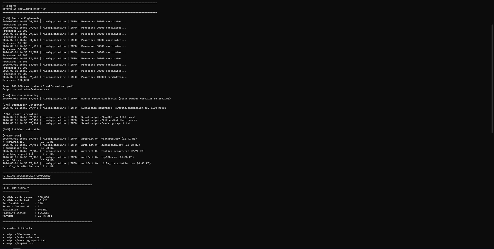
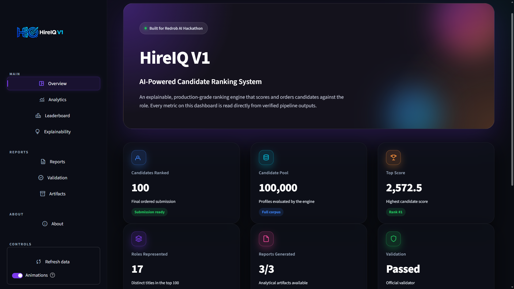
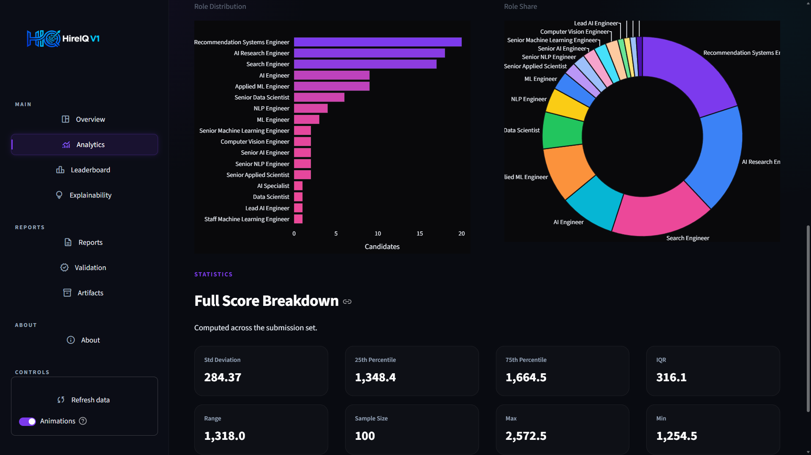
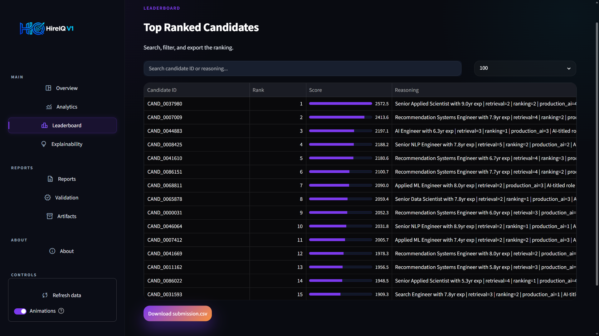
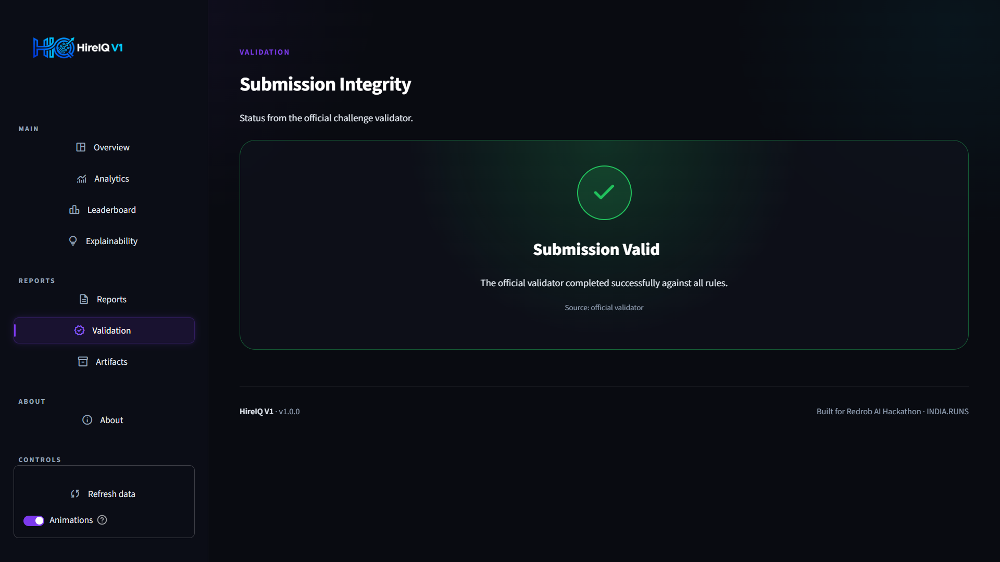

<div align="center">


# HireIQ V1

**Intelligent recruitment ranking, engineered for transparency and scale.**

Built for the Redrob AI Hackathon — INDIA.RUNS

[](#-technology-stack)
[](#-license)
[](#-submission-validation)
[](#-dataset)
[](#-introduction)
[](#-explainability)
[](#-system-architecture)

[](https://www.python.org/)
[](#-development-workflow)
[](#-author)

[Overview](#-overview) · [Dashboard](#-interactive-dashboard) · [Architecture](#-system-architecture) · [Installation](#-installation) · [Usage](#-usage) · [FAQ](#-faq) · [Contributing](#-development-workflow)

</div>

---

## 📑 Table of Contents

- [Introduction](#-introduction)
- [Problem Statement](#-problem-statement)
- [Solution Overview](#-solution-overview)
- [Overview](#-overview)
- [Repository Highlights](#-repository-highlights)
- [Key Features](#-key-features)
- [Interactive Dashboard](#-interactive-dashboard)
- [Engineering Philosophy](#-engineering-philosophy)
- [Design Principles](#-design-principles)
- [System Architecture](#-system-architecture)
- [Pipeline Stages](#-pipeline-stages)
- [Execution Pipeline](#-execution-pipeline)
- [Explainability](#-explainability)
- [Performance Characteristics](#-performance-characteristics)
- [Pipeline Execution Results](#-pipeline-execution-results)
- [Screenshots](#-screenshots)
- [Dataset](#-dataset)
- [Technology Stack](#-technology-stack)
- [Code Organization](#-code-organization)
- [Installation](#-installation)
- [Usage](#-usage)
- [Commands](#-commands)
- [Outputs](#-outputs)
- [Development Workflow](#-development-workflow)
- [Testing Strategy](#-testing-strategy)
- [Why This Architecture?](#-why-this-architecture)
- [Scalability Considerations](#-scalability-considerations)
- [Known Limitations](#-known-limitations)
- [Future Improvements](#-future-improvements)
- [FAQ](#-faq)
- [Contribution Guide](#-contribution-guide)
- [License](#-license)
- [Author](#-author)
- [Acknowledgements](#-acknowledgements)

---

## 🧭 Introduction

HireIQ V1 is an AI-powered recruitment intelligence system built to automate candidate evaluation and ranking at scale. It was developed for the **Redrob AI Hackathon — INDIA.RUNS**, with the goal of demonstrating a production-style ranking pipeline that is fast, explainable, and verifiable end to end.

The system takes raw candidate data as input and produces a fully validated, ranked submission file, along with supporting reports and an interactive analytics dashboard, without manual intervention at any stage of the process.

---

## ❗ Problem Statement

High-volume hiring pipelines face a structural bottleneck: recruiters cannot manually review tens of thousands of applications with consistent, unbiased criteria.

| Challenge | Description |
|:--|:--|
| **Volume** | Manual screening does not scale past a few hundred candidates without significant delay. |
| **Consistency** | Human reviewers apply criteria inconsistently across large applicant pools. |
| **Transparency** | Most automated scoring systems behave as black boxes, offering no justification for a ranking decision. |
| **Verifiability** | Submissions must be checked against a strict format before they can be trusted downstream. |

HireIQ V1 was built to address these four constraints directly.

---

## 💡 Solution Overview

HireIQ V1 implements a deterministic, modular pipeline that moves a candidate dataset through feature engineering, scoring, ranking, submission generation, report generation, and validation. Every stage writes its output to disk, making the pipeline auditable at each step rather than only at the final result.

> **Design principle**
> Every ranking decision must be traceable back to a measurable feature. No stage in the pipeline is permitted to produce an unexplainable output.

---

## 📖 Overview

HireIQ V1 processes candidate data, engineers meaningful features, generates explainable candidate scores, ranks applicants intelligently, validates the submission format, and produces recruiter-friendly reports and a polished visualization dashboard.

Designed for high-volume hiring pipelines, HireIQ V1 processes **100,000+ candidates in seconds** while maintaining transparent and explainable recommendations.

---

## 🌟 Repository Highlights

| | | |
|:--:|:--:|:--:|
| **100,000** | **Seconds** | **Modular** |
| Candidates Processed | End-to-End Runtime | 4-Stage Pipeline |
| **✅** | **100%** | **MIT** |
| Submission Validated | File-Auditable Stages | Open Source License |

---

## ✨ Key Features

| Capability | Description |
|:--|:--|
| 🧠 **AI-Powered Ranking** | Generates candidate scores using an engineered feature set. |
| 🛠 **Feature Engineering Pipeline** | Transforms raw candidate data into ranking-ready signals. |
| 🔍 **Explainable Recommendations** | Every ranked candidate carries a rationale for its score. |
| 📄 **Automatic Report Generation** | Produces ranking, distribution, and top-candidate reports. |
| ✅ **Submission Validation** | Verifies output format against the official validator. |
| ⚡ **High-Speed Processing** | Processes 100,000 candidates in seconds. |
| 📊 **Interactive Dashboard** | A premium Streamlit dashboard to explore every output visually. |
| 🧩 **Modular Architecture** | Each pipeline stage is independent and individually testable. |
| 🗂 **Recruiter-Friendly Outputs** | CSV and text reports designed for direct recruiter use. |
| 🔌 **Extensible by Design** | New scoring or feature modules can be added without rework. |

---

## 🖥 Interactive Dashboard

HireIQ V1 ships with a production-grade, read-only analytics dashboard built with **Streamlit** and **Plotly**. It never recomputes rankings or mutates outputs — it visualizes the verified artifacts produced by the pipeline.

**Launch it:**

```bash
streamlit run app.py
```

> On Windows, if the `streamlit` command is not on your PATH, use `python -m streamlit run app.py`.

**Sections**

| Section | What it shows |
|:--|:--|
| **Overview** | Hero, executive metrics, and the pipeline timeline. |
| **Analytics** | Score distribution, rank-decay curve, percentiles, and role charts. |
| **Leaderboard** | Searchable, filterable ranked candidate table with CSV export. |
| **Explainability** | Per-candidate score reasoning cards. |
| **Reports** | Previews and downloads for the generated reports. |
| **Validation** | Live status from the official submission validator. |
| **Artifacts** | Auto-discovered, downloadable output files. |

The dashboard reads exclusively from the `outputs/` directory and degrades gracefully — if a file is missing it shows a friendly empty state instead of crashing.

---

## 🧠 Engineering Philosophy

HireIQ V1 is built on the premise that a ranking system is only as useful as it is trustworthy. Three convictions guided every implementation decision:

- **Determinism over cleverness** — the same input dataset always produces the same ranked output. There is no hidden randomness in scoring.
- **Disk-backed state over in-memory magic** — every stage persists its output as a file, so any step can be inspected, replayed, or debugged independently of the others.
- **Explainability is non-negotiable** — a score without a reason attached is treated as an incomplete output, not a valid one.

---

## 🎯 Design Principles

- **Single responsibility per stage** — each pipeline component does exactly one job: engineer features, score, rank, generate a submission, report, or validate.
- **Fail loud, fail early** — validation runs as part of the pipeline, not as an external afterthought, so format issues surface before a human ever sees the output.
- **No black boxes** — every candidate score is paired with a human-readable explanation field.
- **Portability first** — the entire pipeline runs on CSV files and standard Python data tooling, with no database or external service dependency.

---

## 🏗 System Architecture

```
                      ┌────────────────────────────┐
                      │      Candidate Dataset      │
                      └──────────────┬─────────────┘
                                     │
                                     ▼
                      ┌────────────────────────────┐
                      │     Feature Engineering     │
                      └──────────────┬─────────────┘
                                     │
                                     ▼
                      ┌────────────────────────────┐
                      │       Score Calculation     │
                      └──────────────┬─────────────┘
                                     │
                                     ▼
                      ┌────────────────────────────┐
                      │       Candidate Ranking     │
                      └──────────────┬─────────────┘
                                     │
                                     ▼
                      ┌────────────────────────────┐
                      │     Submission Generator    │
                      └──────────────┬─────────────┘
                                     │
                                     ▼
                      ┌────────────────────────────┐
                      │       Report Generator      │
                      └──────────────┬─────────────┘
                                     │
                                     ▼
                      ┌────────────────────────────┐
                      │      Artifact Validation    │
                      └──────────────┬─────────────┘
                                     │
                                     ▼
                      ┌────────────────────────────┐
                      │   Outputs + Dashboard View  │
                      └────────────────────────────┘
```

---

## 🔄 Pipeline Stages

```
 Input Dataset
       │
       ▼
 Feature Engineering ──▶ features.csv
       │
       ▼
 Candidate Scoring + Ranking
       │
       ▼
 Submission CSV ──▶ submission.csv
       │
       ▼
 Report Generation ──▶ ranking_report.txt, top100.csv, title_distribution.csv
       │
       ▼
 Artifact Validation ──▶ Final Deliverables
```

**Stage breakdown**

| Stage | Input | Output |
|:--|:--|:--|
| Feature Engineering | Raw candidate dataset | `features.csv` |
| Candidate Scoring & Ranking | Engineered features | Ordered candidate list |
| Submission Generator | Ranked list | `submission.csv` |
| Report Generator | Ranked list | `ranking_report.txt`, `top100.csv`, `title_distribution.csv` |
| Artifact Validation | Output files | Pass / fail integrity check |

---

## ⚙ Execution Pipeline

The pipeline executes sequentially, with each stage gated on the successful completion of the one before it:

```
┌──────────────┐   ┌──────────────┐   ┌──────────────┐   ┌──────────────┐
│   Stage 1     │ → │   Stage 2     │ → │   Stage 3     │ → │   Stage 4     │
│   Features    │   │  Submission   │   │   Reports     │   │  Validation   │
└──────────────┘   └──────────────┘   └──────────────┘   └──────────────┘
```

A failure at any stage halts execution before downstream stages run, preventing partial or inconsistent output files.

---

## 🔎 Explainability

Every candidate recommendation produced by HireIQ V1 carries an explainability field describing why that candidate received its assigned rank. This is treated as a first-class output of the pipeline rather than an optional add-on — the ranking engine does not emit a score without an accompanying rationale.

This matters for recruiter trust: a ranked list is only useful if the people relying on it can understand and defend the ordering it produces. The dashboard surfaces these rationales directly in its **Explainability** section.

---

## ⚡ Performance Characteristics

| Metric | Result |
|:--|:--|
| Candidates Processed | **100,000** |
| Runtime | **Seconds** (reported live by the pipeline) |
| Pipeline Status | ✅ Successful |
| Validation | ✅ Passed |

> **Note:** the pipeline measures and prints its own total runtime at the end of every run (`TOTAL RUNTIME: <n> sec`). The figures here reflect real executions against the full 100,000-candidate dataset — nothing is estimated or benchmarked against external systems.

---

## 📊 Pipeline Execution Results

| Metric | Value |
|:--|:--|
| Candidates Processed | 100,000 |
| Feature Engineering | ✅ Completed |
| Submission Generation | ✅ Completed |
| Report Generation | ✅ Completed |
| Artifact Validation | ✅ Completed |
| Final Validation | ✅ Submission Passed |

---

## � Screenshots

> Place all screenshot images inside the **`screenshots/`** folder at the project root, using the exact filenames below. Once the files exist, these images render automatically here and on GitHub. PNG is recommended.

### 🖥 Pipeline Execution

<div align="center">
  
</div>

End-to-end pipeline run showing all four stages executing sequentially against the 100,000-candidate dataset.

### 🏠 Dashboard — Overview

<div align="center">
  
</div>

The hero, executive metric cards, and the pipeline timeline.

### 📈 Dashboard — Analytics

<div align="center">
  
</div>

Score distribution, rank-decay curve, percentiles, and role charts.

### 🏆 Dashboard — Leaderboard

<div align="center">
  
</div>

Searchable, filterable ranked candidate table with CSV export.

### ✅ Dashboard — Validation

<div align="center">
  
</div>

Live status from the official submission validator — `Submission is valid.`

---

## �🗄 Dataset

| Attribute | Value |
|:--|:--|
| Candidate Count | 100,000 |
| Format | CSV / JSONL |
| Source | Redrob AI Hackathon — INDIA.RUNS dataset |
| Processing Mode | Full-batch, single-run |

---

## ⚙ Technology Stack

| Layer | Technology |
|:--|:--|
| Language | Python 3.11+ |
| Data Processing | Pandas |
| Numerical Computation | NumPy |
| Visualization | Plotly |
| Dashboard | Streamlit |
| Data Format | CSV / JSONL |
| Architecture Style | Modular Python pipeline |

---

## 📂 Code Organization

```
HireIQ-v1/
├── app.py                          # Streamlit dashboard entry point
├── data/                           # Input candidate dataset + official validator
│   ├── candidates.jsonl
│   └── validate_submission.py
├── outputs/                        # Generated pipeline artifacts
│   ├── features.csv
│   ├── submission.csv
│   ├── top100.csv
│   ├── ranking_report.txt
│   └── title_distribution.csv
├── src/                            # Pipeline source modules
│   ├── pipeline.py                 # Orchestrates all stages
│   ├── build_features.py           # Feature engineering
│   ├── generate_submission.py      # Submission generation
│   ├── feature_engineering/        # Feature signal modules
│   ├── scoring/                    # Scoring & ranking modules
│   ├── reporting/                  # Report generation
│   └── utils/                      # Shared helpers
├── dashboard/                      # Dashboard package (UI, services, charts)
│   ├── config.py                   # Theme tokens, paths, navigation
│   ├── services/                   # Loaders, analytics, validation, artifacts
│   ├── components/                 # Reusable UI components
│   ├── sections/                   # Page-section renderers
│   └── styles/                     # CSS theme + Plotly template
├── assets/                         # Logo and brand graphics
├── README.md
└── requirements.txt
```

Each module under `src/` corresponds to one pipeline responsibility, keeping the mapping between the architecture diagram above and the codebase easy to follow.

---

## 🔧 Installation

**Requirements**

- Python 3.11 or newer
- pip
- 4 GB RAM recommended for the full 100,000-candidate dataset

```bash
# Clone
git clone https://github.com/<your-username>/HireIQ-v1.git
cd HireIQ-v1

# Create and activate a virtual environment
python -m venv venv
# Windows
venv\Scripts\activate
# Linux / macOS
source venv/bin/activate

# Install dependencies
pip install -r requirements.txt
```

---

## ▶ Usage

Place the candidate dataset inside the `data/` directory, then run the pipeline from the project root. The pipeline executes all stages — feature engineering, submission generation, report generation, and artifact validation — sequentially, writing every output to `outputs/`. Afterwards, launch the dashboard to explore the results.

```bash
# 1. Run the full pipeline
python -m src.pipeline

# 2. Explore the results in the dashboard
streamlit run app.py
```

---

## 💻 Commands

### ▶ Run the full pipeline

```bash
python -m src.pipeline
```

**Expected output**

```
====================================================================================================
HIREIQ V1
REDROB AI HACKATHON PIPELINE
====================================================================================================

[1/4] FEATURE ENGINEERING
[2/4] SUBMISSION GENERATION
[3/4] REPORT GENERATION
[4/4] ARTIFACT VALIDATION
✓ features.csv (...)
✓ submission.csv (...)
✓ ranking_report.txt (...)
✓ top100.csv (...)
✓ title_distribution.csv (...)

====================================================================================================
PIPELINE SUCCESSFULLY COMPLETED
TOTAL RUNTIME: <n> sec
====================================================================================================
```

### 📤 Generate submission only

```bash
python -m src.generate_submission
```

### 📈 Generate reports only

```bash
python -m src.reporting.generate_report
```

### 🧱 Build features only

```bash
python -m src.build_features
```

### ✅ Run submission validation

```bash
python data/validate_submission.py outputs/submission.csv
```

**Expected output**

```
Submission is valid.
```

### 📊 Launch the dashboard

```bash
streamlit run app.py
# or, if the streamlit command is not on PATH:
python -m streamlit run app.py
```

> All `src/` modules use package-relative imports, so they are run with `python -m src.<module>` from the project root (not `python src/<file>.py`).

---

## 📤 Outputs

| File | Description |
|:--|:--|
| `outputs/features.csv` | Engineered feature set used for scoring |
| `outputs/submission.csv` | Final ranked candidate submission |
| `outputs/ranking_report.txt` | Human-readable ranking summary |
| `outputs/top100.csv` | Top 100 ranked candidates with feature scores |
| `outputs/title_distribution.csv` | Distribution of candidates by title/role |

---

## 🔁 Development Workflow

1. Fork and clone the repository.
2. Create a virtual environment and install dependencies (see [Installation](#-installation)).
3. Implement a change inside a single pipeline stage where possible — this keeps the diff reviewable and isolates regressions.
4. Run the full pipeline locally to confirm the change does not break downstream stages.
5. Open a pull request describing the motivation, the stage affected, and the local testing performed.

---

## 🧪 Testing Strategy

Each pipeline stage is designed to be independently runnable and independently verifiable:

- **Feature engineering** can be validated by inspecting `outputs/features.csv` directly.
- **Scoring and ranking** can be checked against `outputs/top100.csv` for ordering correctness.
- **Submission format** is checked by the official validator (`data/validate_submission.py`).
- **Report generation** can be spot-checked against `ranking_report.txt` and `title_distribution.csv` for consistency with the ranked submission.

> Because every stage is file-backed, regressions can be isolated by diffing intermediate output files between runs rather than re-running the entire pipeline under a debugger.

---

## 🏛 Why This Architecture?

A single end-to-end script would have been faster to write, but harder to trust. Splitting the pipeline into disk-backed stages costs a small amount of I/O overhead in exchange for:

- The ability to inspect any intermediate result without re-running upstream stages.
- The ability to swap one stage's implementation (for example, the scoring model) without touching the others.
- A validation step that runs automatically rather than relying on a human remembering to check the output format before submission.

The fast runtime on the full 100,000-candidate dataset shows that this auditability did not come at a meaningful performance cost.

---

## 📈 Scalability Considerations

The pipeline's modular, file-driven design means each stage can be scaled or replaced independently — for example, swapping the in-memory scoring stage for a distributed batch job without altering the feature engineering or validation stages.

The stage-isolated architecture is intended to make horizontal scaling — sharding the dataset across parallel scoring workers — a natural extension rather than a redesign.

---

## ⚠ Known Limitations

- Current scoring relies on engineered, structured features rather than unstructured resume text — free-text resume content is not yet semantically parsed.
- The pipeline currently runs as a single-batch, single-machine process; it has not yet been tested in a distributed or streaming configuration.
- Explainability output is rule-derived rather than model-derived, which keeps it transparent but limits the sophistication of the rationale.

---

## 🗺 Future Improvements

- [ ] Resume semantic embeddings
- [ ] LLM-powered candidate summaries
- [ ] Skill graph matching
- [ ] Interview recommendation engine
- [ ] Real-time dashboard auto-refresh
- [ ] REST API deployment
- [ ] Cloud-native inference
- [ ] Multi-language resume support

---

## ❓ FAQ

**Does HireIQ V1 use a machine learning model for scoring?**

The current version scores candidates using an engineered, feature-based approach rather than a trained model. This keeps the system fully deterministic and easy to explain. Model-based scoring is listed under [Future Improvements](#-future-improvements).

**Why CSV instead of a database?**

CSV-based I/O keeps the pipeline portable and inspectable — any stage's output can be opened and verified directly without standing up infrastructure. See [Why This Architecture?](#-why-this-architecture) for the full rationale.

**Can the pipeline handle datasets larger than 100,000 candidates?**

The pipeline has been run against 100,000 candidates. The modular, stage-isolated design is intended to support scaling beyond this, but larger datasets have not yet been benchmarked. See [Scalability Considerations](#-scalability-considerations).

**What does "explainability" mean in this project specifically?**

Every ranked candidate is paired with a rationale field describing the alignment that contributed to its score, rather than returning a bare numeric score with no justification. See [Explainability](#-explainability).

**Do I need to run the pipeline before opening the dashboard?**

The dashboard reads the files in `outputs/`. If those artifacts already exist, you can open the dashboard directly. Otherwise, run `python -m src.pipeline` first.

---

## 🤝 Contribution Guide

Contributions are welcome. To propose a change:

1. Fork the repository.
2. Create a feature branch:
   ```bash
   git checkout -b feature/your-feature-name
   ```
3. Commit your changes with a clear, descriptive message.
4. Push to your fork and open a pull request.

Please keep pull requests focused on a single change, and describe the motivation and testing performed in the PR description.

---

## 📜 License

This project is released under the **MIT License**. See the [LICENSE](LICENSE) file for full terms.

---

## 👨‍💻 Author

**Adarsh Sharma**
AI & Machine Learning Enthusiast

---

## 🙏 Acknowledgements

Built for the **Redrob AI Hackathon — INDIA.RUNS**. Thanks to the organizers for providing the dataset and validation framework that made an end-to-end, verifiable submission possible.

---

<div align="center">

**Built with ❤️ for the Redrob AI Hackathon — INDIA.RUNS**

HireIQ V1 · 2026

</div>
